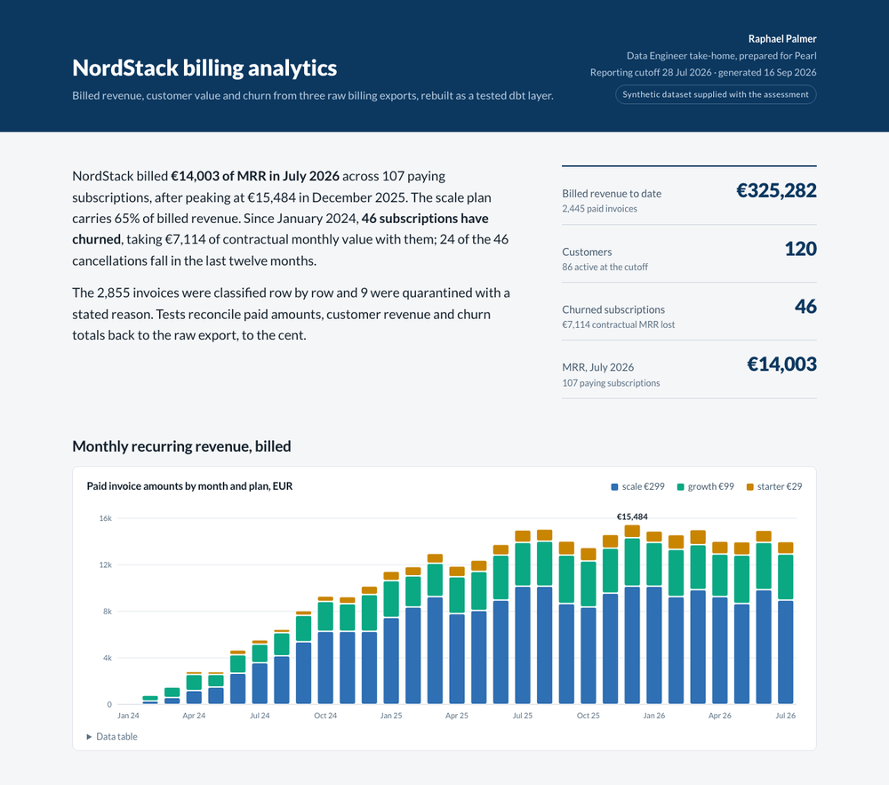

# NordStack billing analytics

A tested analytics layer over three raw billing exports: MySQL as the source system,
dlt into Postgres, dbt for the models and tests, Airflow to run it every five minutes,
and a one-page report read straight from the marts.

## Results

| | |
|---|---|
| Billed revenue to date | €325,282 over 2,445 paid invoices (Jan 2024 to Jul 2026) |
| MRR, July 2026 | €14,003 across 107 paying subscriptions; peak €15,484 in Dec 2025 |
| Customers | 120, of which 86 active at the cutoff |
| Churn | 46 subscriptions, €7,114 of contractual MRR |
| Data quality | 28 warn-level checks on the raw tables, 17 fail on this export; 10 rows quarantined, 2 duplicates collapsed |
| Reconciliation | €325,086.01 paid in the source = €325,282.01 in the marts + (-€196.00) quarantined paid amounts |

Open [`report/nordstack-billing-report.html`](report/nordstack-billing-report.html) for the
full page, or run `make docs` for the dbt documentation and lineage. The marts live in
schema `analytics_marts`:

    select revenue_month, plan_name, mrr_eur
    from analytics_marts.fct_mrr_monthly_by_plan
    where revenue_month >= date '2026-01-01'
    order by 1, 2;

## Run it

    make bootstrap

From a clean clone that starts MySQL and Postgres, loads `data/*.csv` into MySQL, syncs
them to Postgres with dlt, installs dbt 1.11, and runs `dbt build`. It ends with
`ERROR=0` and 17 warnings: the source diagnostics listed below, which are meant to warn.

| Target | What it does |
|---|---|
| `make bootstrap` | everything above, in order |
| `make build` | `dbt build` only |
| `make docs` | generate and serve the dbt documentation |
| `make report` | rebuild `report/nordstack-billing-report.html` from the marts |
| `make airflow-test` | parse the DAG in an isolated Airflow 3.3 install |
| `make nuke` | stop both databases and drop their volumes |

Requirements: Docker with Compose v2, Python 3.12, make. If port 5432 or 3306 is taken,
copy `.env.example` to `.env` and change `NORDSTACK_PG_PORT` or `NORDSTACK_MYSQL_PORT`;
compose, ingestion, dbt and the report all read the same variables.

## How it is built

    data/*.csv  ->  MySQL (billing)  ->  dlt  ->  Postgres raw  ->  dbt  ->  marts  ->  report
                                                       |
                                          28 warn-level checks

    data/                 billing CSV exports, the assessment input, unchanged
    ingestion/            load_source_system.py (CSV -> MySQL), sync_to_warehouse.py (dlt MySQL -> Postgres)
    models/sources.yml    raw tables with warn-level diagnostics
    models/staging/       base_* type and classify subscriptions and invoices; stg_* keep the usable rows
    models/quarantine/    rej_* keep the rejected ones, each with a reject_reason
    models/intermediate/  paid invoices in EUR within the cutoff, month spine
    models/marts/         fct_mrr_monthly_by_plan, dim_customer_ltv, fct_churn_monthly
    tests/sources/        singular diagnostics (warn) and an empty-source guard (error)
    tests/staging/        disposition and billing-rule tests (error)
    tests/marts/          reconciliation and coverage tests (error)
    report/               template and builder for the one-page report
    airflow/              DAG, parse test, deploy notes

## Decisions

**Ingestion.** MySQL stands in for the billing system. dlt's `sql_database` source syncs
the three tables to Postgres schema `raw` with `write_disposition="replace"`: the source
has no updated-at column or change log, and the tables are small, so a full reload is
appropriate. dlt adds `_dlt_load_id` and `_dlt_id` to every row.

**Raw stays raw.** Columns arrive as text and are cast once, in `base_*` (or in
`stg_customers`, which has no base model because customers are never rejected). Empty
CSV cells are loaded as SQL NULL. Casts are deliberately
fail-fast: a malformed date or amount stops the build instead of being quarantined,
because it requires investigation.

**Clean column plus `_raw` column, no flags.** When a value fails a rule the clean column
is NULL and the `_raw` column keeps the export value (`email` / `email_raw`,
`created_at` / `created_at_raw`, `end_date` / `end_date_raw`). "Invalid" is therefore
"clean is NULL and raw is not".

**Quarantine, not deletion.** `base_*` assigns a `reject_reason` to rows no mart can use
(non-positive price or amount, missing amount or start date, unknown plan, status,
currency or subscription). `stg_*` keeps the rest, `rej_*` keeps the rejected rows, and a
test proves the two add up to the raw rows (distinct raw rows for subscriptions, which
hold an exact duplicate). Two defects are deliberately not rejected:
a subscription whose customer is missing from the export (its paid invoices count in
MRR and cannot be attributed in LTV), and a subscription whose end date precedes its
start date (its invoices count; its end date is nulled, so it keeps the exported status
cancelled but is never counted as churn, having no trusted month).

**Materialisation.** Staging, quarantine and intermediate are views over the latest
loaded data. Marts are tables, which is what BI reads.

**MRR is billed, churn loss is contractual.** `fct_mrr_monthly_by_plan` sums paid invoice
amounts in EUR by invoice month, as the brief asks. `fct_churn_monthly` sums
`monthly_price` of subscriptions cancelled in the month. The two bases differ on purpose.

**Fixed cutoff.** `as_of_date` (2026-07-28, the last invoice date) replaces
`current_date` everywhere, so the marts do not change without new data. It also defines
two extra subscription states: `pending` (not cancelled, starts after the cutoff) and
`pending_cancellation` (cancelled for a date after the cutoff, still running and billed).
A customer's `current_status` takes the strongest state across their subscriptions
(active, then pending_cancellation, paused, pending, cancelled).

**Currency.** The two SEK invoices are converted with the `fx_rates_to_eur` var; any
other currency would be rejected. `monthly_price` has no
currency in the export and is assumed EUR.

**Simplifying billing rule.** No invoice may be dated after a trusted cancellation date.
It holds in the clean layer and is asserted there.

## Data-quality findings

| # | Issue | Record | Caught by | Handling |
|---|---|---|---|---|
| 1 | Duplicate customer row | C0023 | unique | collapsed |
| 2 | Invalid email | C0016 | valid_email | email NULL, email_raw kept |
| 3 | Missing country | C0008 | not_null | NULL |
| 4 | Created in the future, after its own subscription | C0041 / S00054 | two singular tests | created_at NULL (either rule), created_at_raw kept |
| 5 | Duplicate subscription row | S00006 | unique | collapsed |
| 6 | Subscription with unknown customer | S00011 -> C9999 | relationships | kept; revenue in MRR, absent from LTV |
| 7 | Upper-case status | S00026 | accepted_values | lower-cased |
| 8 | Negative price and 7 negative invoices | S00048 | expression_is_true | subscription and invoices quarantined |
| 9 | End date before start date, 17 invoices after it | S00034 | singular tests | end_date NULL; invoices kept; status cancelled but never churn |
| 10 | Starts after the cutoff | S00149 | singular test | state pending |
| 11 | Cancelled for a date after the cutoff | S00020, S00070, S00139, S00167 | singular test | state pending_cancellation; not churn |
| 12 | Invoice with unknown subscription | I000601 -> S99999 | relationships | quarantined |
| 13 | Paid invoice with no amount | I000322 | not_null | quarantined |
| 14 | Status with trailing space and upper case | I000451 | accepted_values | trimmed, lower-cased |
| 15 | Two SEK invoices | I000101, I000201 | accepted_values | converted at the var rate |

Two observations that are not defects but matter for the numbers: paused subscriptions
keep being invoiced, and for 14 customers the newest subscription is not the active one,
which is why status is aggregated rather than taken from the latest row.

## Tests

Source diagnostics are WARN and are meant to keep warning: they document the export.
Handling lives in `base_*` and `stg_*`. Disposition tests prove clean + rejected = raw
(distinct raw rows for subscriptions). Reconciliation
tests tie paid revenue, LTV and churn back to the source; coverage tests prove MRR has
exactly one row per spine month and plan, churn one per spine month, LTV one per
customer. dbt unit tests pin the rules with the most branches: subscription state at the
cutoff, customer status precedence and revenue attribution, churn by month, MRR by month
and plan. Everything after staging is ERROR.

## Airflow

`airflow/dags/nordstack_billing.py` runs `dlt_sync >> dbt_build` every five minutes and
emails on success and on failure through DAG-level notifiers. Deploy assumptions and the
parse test are in [`airflow/README.md`](airflow/README.md).

## Report

`make report` renders [`report/nordstack-billing-report.html`](report/nordstack-billing-report.html)
from the marts: one HTML file with the chart data embedded, inline SVG charts with hover
detail (MRR, customer ranking and churn also carry a data table), printable to PDF. The
only external request is the Lato web font. `report/template.html` holds the layout, the
chart code and the prose; `report/build_report.py` refreshes headline metrics, charts and
row counts from the warehouse. Diagnostic counts, plan prices and the findings table
describe this export and are written by hand.

## Validation record

| Check | Command | Outcome |
|---|---|---|
| Clean-clone build | `git clone . /tmp/x && cd /tmp/x && make bootstrap` | `PASS=100 WARN=17 ERROR=0` (dbt-core 1.11.15, dbt-postgres 1.11.0, dlt 1.30.0, Postgres 16, MySQL 8.4) |
| DAG parse | `make airflow-test` | 1 passed (apache-airflow 3.3.1) |
| Marts vs an independent replica | pandas over `data/*.csv` with the documented rules | MRR 325,282.01; LTV 322,890.01; churn 46 / 7,114.00, all equal |
| Report | `make report` | 36 KB, cutoff 2026-07-28 |

CI is listed under next steps; it is not set up in this repository.

## Limitations

- The reporting cutoff is 2026-07-28, so July 2026 holds 28 days of invoices.
- €2,392 of paid revenue belongs to a subscription with no customer record; it is in
  MRR and not in any customer's lifetime value.
- One paid invoice has no amount and cannot be valued; it is quarantined and counted.
- SEK is converted at a fixed 0.087; `monthly_price` is assumed EUR.
- Email delivery from the DAG is configured, not exercised.

## Next steps

- Incremental dlt loads once the source exposes an updated-at column or CDC.
- dbt snapshots on subscriptions for status history and true contractual MRR.
- CI with `dbt build --select state:modified+` against a production manifest.
- FX from a rates table; dbt-expectations for distribution checks.
